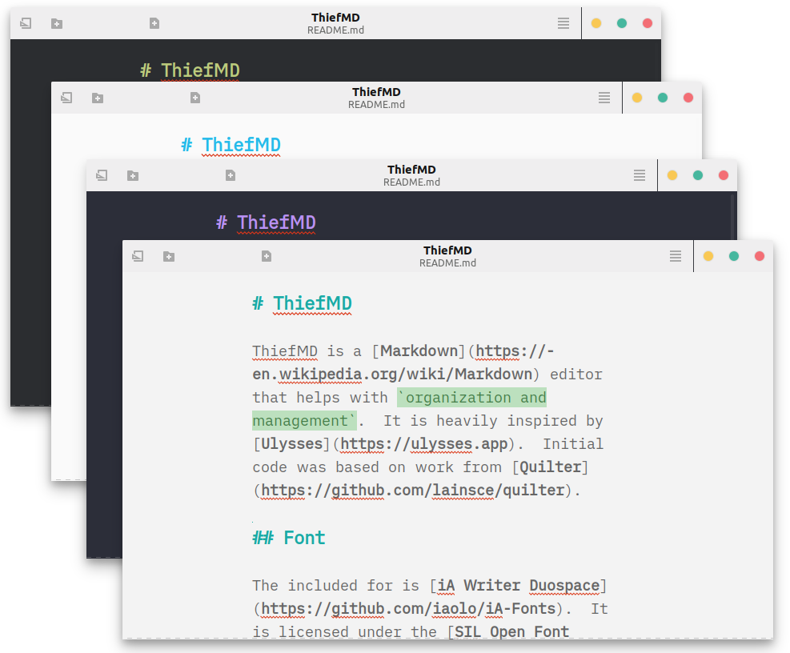
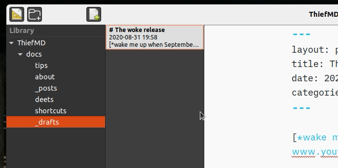
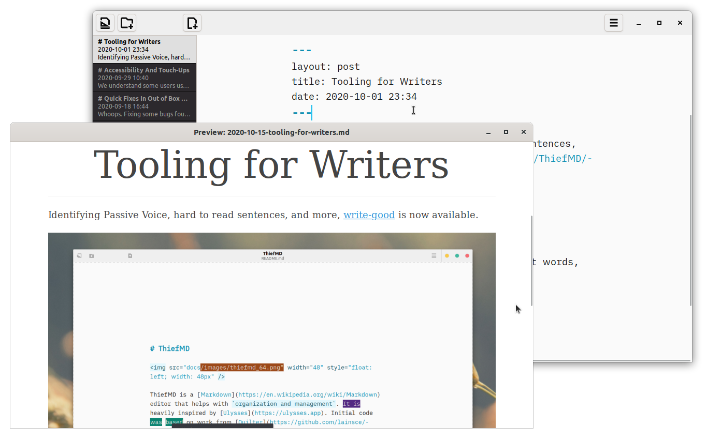
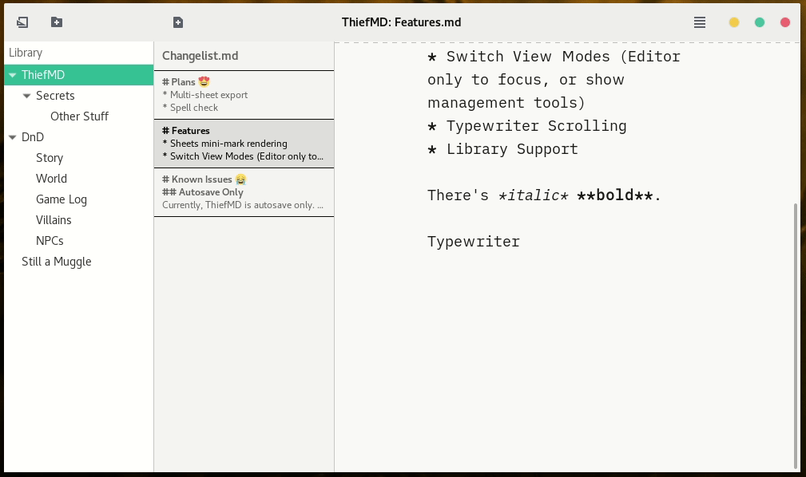

# ThiefMD


ThiefMD is a [Markdown](https://en.wikipedia.org/wiki/Markdown) editor that helps with `organization and management`. It is heavily inspired by [Ulysses](https://ulysses.app). Initial code was based on work from [Quilter](https://github.com/lainsce/quilter).

## Installation from Flatpak

[ThiefMD](https://flathub.org/apps/details/com.github.kmwallio.thiefmd) is now available on Flathub. Make sure you've added [flathub](https://flatpak.org/setup) to your system.

```bash
flatpak install flathub com.github.kmwallio.thiefmd
```

## Features

 * Basic library at the moment
 * Switch between documents
 * Hide Library and Document Switcher
 * Live Preview
 * Sheet Management
 * Shortcut key bindings
 * Themes

## Planning

 * Better library organization
 * Export

## Screenshots



[Ulysses Themes](https://styles.ulysses.app/themes) can be imported into the library. Displayed are [Tomorrow Dark](https://styles.ulysses.app/themes/tomorrow-qyp), Default ThiefMD Theme, [Dracula](https://styles.ulysses.app/themes/dracula-ZwJ), and [WWDC16](https://styles.ulysses.app/themes/wwdc16-04B).



Drag and Drop organizing of the library.



Live Preview



Typewriter Scrolling.

## Dependencies

As part of the build, [gxml](https://gitlab.gnome.org/GNOME/gxml) and the [Ulysses Theme Parser](https://github.com/TwiRp/ultheme-vala) will be cloned and built.

### Ubuntu

```
meson
ninja-build
valac
cmake
libgtkspell3-3-dev
libwebkit2gtk-4.0-dev
libmarkdown2-dev
libxml2-dev
libclutter-1.0-dev
libarchive-dev
libgtk-3-dev
libgtksourceview-3.0-dev
```

### Fedora

```
vala
meson
ninja-build
cmake
libmarkdown-devel
clutter-gtk-devel
webkit2gtk3-devel
gtk3-devel
gtksourceview3-devel
gtkspell3-devel
libarchive-devel
```

## Building

```bash
$ meson build && cd build
$ meson configure -Dprefix=/usr
$ ninja
$ sudo ninja install
```

[Prebuilt packages](https://github.com/kmwallio/ThiefMD/releases) are available for .deb and .rpm.

## Acknowledgments

* Code <s>stolen</s> *forked* from [Quilter](https://github.com/lainsce/quilter)
* Font is [iA Writer Duospace](https://github.com/iaolo/iA-Fonts)
* Inspired by [Ulysses](https://ulysses.app)
* Preview CSS is [Splendor](http://markdowncss.github.io/splendor) + [Modest](http://markdowncss.github.io/modest)
* Preview Scroll stolen from [this Stackoverflow](https://stackoverflow.com/questions/8922107/javascript-scrollintoview-middle-alignment) by [Rohan Orton](https://stackoverflow.com/users/2800005/rohan-orton)
* Preview Syntax Highlighting by [highlight.js](https://highlightjs.org)
* Math Rendering by [Katex](https://katex.org)
* Multi-format Export by [Pandoc](https://pandoc.org)
* Screenshots use [Vimix GTK Themes](https://github.com/vinceliuice/vimix-gtk-themes) and [Vimix Icon Theme](https://github.com/vinceliuice/vimix-icon-theme)