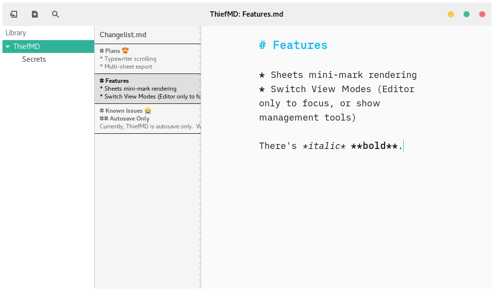

# ThiefMD

ThiefMD is a [Markdown](https://en.wikipedia.org/wiki/Markdown) editor that helps with organization and management.  It is heavily inspired by [Ulysses](https://ulysses.app).  Initial code was based on work from [Quilter](https://github.com/lainsce/quilter).

## Font

The included for is [iA Writer Duospace](https://github.com/iaolo/iA-Fonts).  It is licensed under the [SIL Open Font License](data/font/LICENSE.md).

## Screenshots



Still a work in progress, but this shows the sheets and editor view.  Sheets render a preview of the first few lines of a file, or shows the file name.


Switching editor view modes.


Basic library management.


Drag and Drop organizing of the library.


Live Preview

## Dependencies

```
valac
libgranite-dev
libgtkspell3-3-dev
libwebkit2gtk-4.0-dev
libmarkdown2-dev
gtk+-3.0
gtksourceview-3.0
meson
```

## Building

```bash
$ meson build && cd build
$ meson configure -Dprefix=/usr
$ ninja
$ sudo ninja install
```

## Features

 * Basic library at the moment
 * Switch between documents
 * Hide Library and Document Switcher
 * Live Preview
 * Sheet Management
 * Shortcut key bindings

## Planning

 * Better library organization
 * Export
 * Theming

## Acknowledgments

* Code <s>stolen</s> *forked* from [Quilter](https://github.com/lainsce/quilter)
* Font is [iA Writer Duospace](https://github.com/iaolo/iA-Fonts)
* Inspired by [Ulysses](https://ulyssesapp.com/)
* Preview CSS is [Splendor](http://markdowncss.github.io/splendor/)
* Preview Scroll stolen from [this Stackoverflow](https://stackoverflow.com/questions/8922107/javascript-scrollintoview-middle-alignment) by [Rohan Orton](https://stackoverflow.com/users/2800005/rohan-orton)
