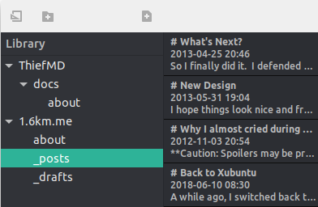

# ThiefMD, the Markdown Editor built on the shoulders of others

Born from Open Source without knowing how Open Source works. ThiefMD is a Markdown editor and file manager inspired by [Ulysses](https://ulysses.app), based on open source code from [Quilter](https://github.com/lainsce/quilter) and other projects.

Manage your \*\*mark\*\* without any \-down\-sides. Your library is your file system. Sync using any service you choose[^no-file-sync]. Even use [Git](https://git-scm.com/) to have a file history[^no-git].

[^no-file-sync]: ThiefMD has no sync support built in.
[^no-git]: ThiefMD has no built in Git support.

## We'll try not to delete all your files

✅ Auto-save  
✅ Live Previews  
✅ Typewriter Scrolling  
✅ Full Screen Editing

If anything goes wrong, it's probably because we implemented it wrong.  We're not liable for lost files or damage to your machine!

# Live Preview

See what your work looks like in real time. Is that your battery draining? Yes, and the Markdown it's powering never looked so good.

# Get ThiefMD!

[Download the latest release](https://github.com/kmwallio/ThiefMD/releases).

Want to check out and build the source? [Instructions are on GitHub](https://github.com/kmwallio/ThiefMD). It's built with Vala and GTK. There's no plans on porting to Mac or Windows. On Mac, we recommend [Ulysses](https://ulysses.app). On Windows, we recommend [Typora](https://typora.io).

These is a stock photo of **happy** people.  They're not using ThiefMD. The photo of people is by [Brooke Cagle](https://unsplash.com/@brookecagle), Wheat by [Matt Hoffman
](https://unsplash.com/@__matthoffman__), and more Wheat by [Jonas Zürcher](https://unsplash.com/@tsueri).

ThiefMD should be gluten and allergy free but was made in a facility that handles wheat, nuts, and shellfish.