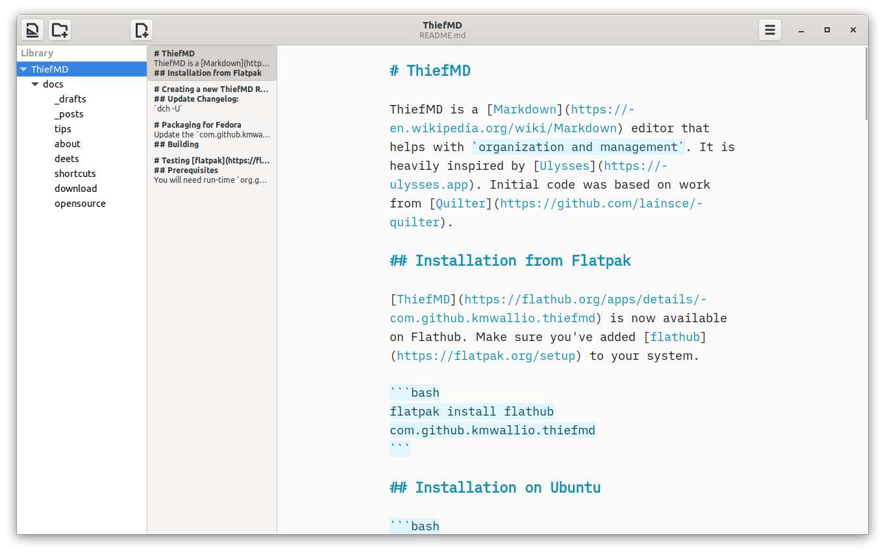

#  ThiefMD, the Markdown Editor worth stealing

Based on Open Source Technologies, ThiefMD is a Markdown editor and file manager inspired by [Ulysses](https://ulysses.app). ThiefMD is based on open source code from [Quilter](https://github.com/lainsce/quilter) and [other projects](/about#credit).

Static Site Generators? Novel Writing? Book reports? ThiefMD loves handling all your markdown files and compiling them to whatever format you need. [Pandoc](https://pandoc.org) runs under the hood, so if you can dream it, ThiefMD can build it.

Manage your \*\*mark\*\* without any \-down\-sides. Your library is your file system. Sync using any service you choose[^no-file-sync]. Even use [Git](https://git-scm.com/) to have a file history[^no-git].

[^no-file-sync]: ThiefMD has no sync support built in.
[^no-git]: ThiefMD has no built in Git support.

## We'll try not to delete all your files

✅ Auto-save  
✅ Live Previews  
✅ Typewriter Scrolling  
✅ Full Screen Editing  
✅ Multiple Export Formats: PDF, ePub, docx, and more  
✅ Multiple Import Formats: ePub, docx, HTML, and more

If anything goes wrong, it's probably because we implemented it wrong.  We're not liable for lost files or damage to your machine!

# Live Preview

See what your work looks like in real time. Is that your battery draining? Yes, and the Markdown it's powering never looked so good.

A separate window allows for focusing on your writing or reading. From [blogging](/tips/jekyll) to [novel writing](/tips/novel-writing), ThiefMD helps your words look good 😎

Once you like what you see, [export with ease](/tips/novel-writing#sharing-your-work) to ePub, DocX, PDF, and more.

Spell checking and weasel word detection are also built in.  
[Want to learn about more features](/deets)?

# Try ThiefMD today

These is a stock photo of **happy** people.  They're not using ThiefMD. The photo of people is by [Brooke Cagle](https://unsplash.com/@brookecagle), Wheat by [Matt Hoffman](https://unsplash.com/@__matthoffman__), more Wheat by [Jonas Zürcher](https://unsplash.com/@tsueri), and even more wheat by [Gaelle Marcel](https://unsplash.com/@gaellemarcel).

ThiefMD should be gluten and allergy free but was made in a facility that handles wheat, nuts, and shellfish.
